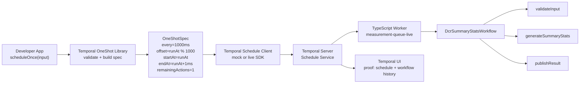
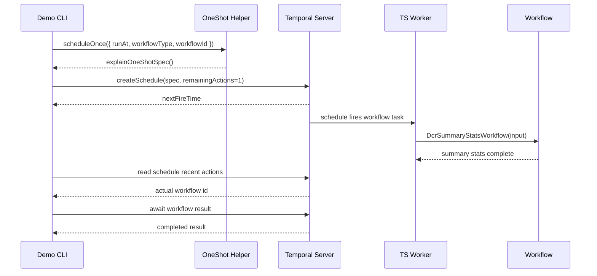

# Temporal OneShot Architecture

## Slide-Ready Diagram



## Slide Caption

Temporal OneShot keeps fire-once scheduling logic out of application code. The app calls `scheduleOnce()`, the helper validates the request and generates a tiny aligned schedule window, and Temporal executes the workflow once with `remainingActions=1`.

## Demo Flow



## Prototype Components

| Component | File | Purpose |
| --- | --- | --- |
| OneShot library | `src/oneshot.ts` | Validates input and builds the synthetic one-shot spec |
| Mock client | `src/mockTemporal.ts` | Fast no-server demo path |
| Live client | `src/liveTemporal.ts` | Creates a real Temporal Schedule via TypeScript SDK |
| Workflow | `src/workflows.ts` | Demo workflow started by the schedule |
| Activities | `src/activities.ts` | Fake business steps for visible workflow completion |
| Live CLI | `src/liveCli.ts` | End-to-end POC against local Temporal |

## Test Cases

| ID | Test Case | Expected Result | Status |
| --- | --- | --- | --- |
| T1 | Build spec for `2026-05-10T10:00:00.123Z` | `everyMs=1000`, `offsetMs=123`, `windowMs=1`, `expectedFireCount=1` | Automated |
| T2 | Invalid `runAt` date | Throws validation error with ISO timestamp suggestion | Automated |
| T3 | Empty `workflowType` | Throws non-empty field validation error | Automated |
| T4 | `scheduleOnce()` with mock client | Returns `oneshot-<workflowId>` and matching next fire time | Automated |
| T5 | `npm run demo` | Prints polished no-server prototype output | Manual demo |
| T6 | `npm run demo:invalid` | Prints validation failure and suggestion | Manual demo |
| T7 | `npm run demo:live` against Temporal | Real schedule created, workflow completes, schedule remaining actions becomes `0` | Verified live |

## Success Scenarios

| Scenario | What To Show | Proof |
| --- | --- | --- |
| Developer-friendly API | Show `scheduleOnce({ workflowType, workflowId, taskQueue, runAt })` | App code avoids schedule-spec details |
| Correct one-shot spec | Show generated plan in terminal | `every=1000ms`, `offset`, `window=1ms`, expected fires exactly 1 |
| Validation catches bad input | Run `npm run demo:invalid` | Clear error and ISO timestamp suggestion |
| Works without Temporal | Run `npm run demo` | Mock schedule and simulated workflow complete |
| Works with real Temporal | Run `npm run demo:live` | Real schedule fires real workflow |
| Exactly-once schedule action | Describe live schedule in Temporal | `RemainingActions 0`, `ActionCounts Total=1` |
| Observable in Temporal UI | Open `http://localhost:8233` | Search for printed workflow id and view history |

## Commands For Demo

```bash
npm test
npm run demo
npm run demo:invalid
npm run demo:live
```

If Temporal is not already running:

```bash
docker run --rm --name temporal-oneshot-dev -p 7233:7233 -p 8233:8233 temporalio/temporal:latest server start-dev --ip 0.0.0.0
```
